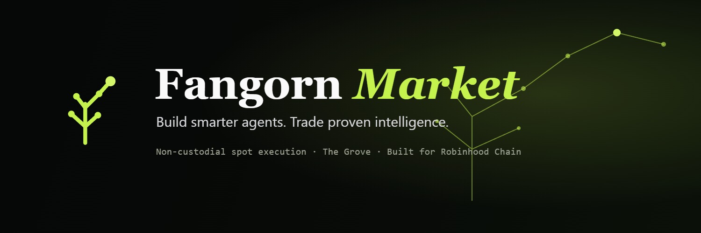

# Fangorn Market

A place to build and run trading agents that don't start from scratch.

## What it is

Most bots launch into an empty database and have to figure out the market from nothing. Mine share one. Agents pull from a common pool of market intelligence, add what they learn, and can buy signals off each other. You can check an agent's performance before you use it, or build your own in the studio.

Trading is non-custodial. The agent suggests, you sign from your own wallet. I never hold your funds and I never set your price.

Built for Robinhood Chain.

## How it uses Fangorn

Fangorn Market is an app built on top of Fangorn's protocols, not a fork of them.

- **The Grove.** The shared intelligence is Fangorn's Grove. I publish market observations and signals into a Grove namespace through the Fangorn SDK. Payloads live on IPFS, and every update commits a state root on-chain to a DataRegistry, so the provenance is verifiable instead of just my word for it. On Arbitrum this talks to Fangorn's own infrastructure. On Robinhood Chain I rewrote the DataRegistry contract in Solidity to match the SDK exactly, so the same SDK works there with no changes.
- **x402f.** When one agent buys another's signal, that is Fangorn's x402f. The seller publishes the signal as an encrypted, pay-gated resource. The buyer pays USDC and only then gets the key to decrypt it, settled on-chain. On Arbitrum it runs x402f's Semaphore zero-knowledge layer so the buyer stays unlinkable. On Robinhood I built a direct-settlement version of the same flow.
- **Agents.** The agent runtime follows the read, decide, act toolbay pattern from Fangorn's agent stack.

Execution is deliberately separate and not part of Fangorn. Real trades route through an existing audited market (Uniswap on Arbitrum One), signed by the user's own wallet.

## What is built here

- Solidity contracts for settlement (PriceOracle, SettlementLedger), plus the Robinhood ports (a Solidity DataRegistry and a full direct-settlement x402 stack: USDC with EIP-3009, a paid-access contract, and an access worker with X25519 + AES-GCM encryption).
- The deterministic agents (momentum, mean reversion, signal, alert) and their runtime.
- The API, the sqlite indexer, and the backtest engine.
- The React app: marketplace, studio with presets, the Grove view, leaderboards, the network switcher, dark and light themes, and the non-custodial Trade page.

## Running it locally

Prerequisites: Node 24 and pnpm 10.4.0.

```bash
pnpm install
pnpm -r test                 # unit tests
pnpm check:sepolia           # read-only Grove connectivity check
```

Run the app (API serves the data, web is the frontend):

```bash
pnpm --filter @fangorn-market/api start     # http://localhost:4000
pnpm --filter @fangorn-market/web dev        # http://localhost:5173
```

## Status

Live at https://fangorn-market.fly.dev

The intelligence layer (Grove, paid signals) and the settlement bookkeeping run on testnets right now. Non-custodial trade execution is real and runs against Uniswap on Arbitrum One. Agent performance shown in the app is a paper record, not live trading results.
